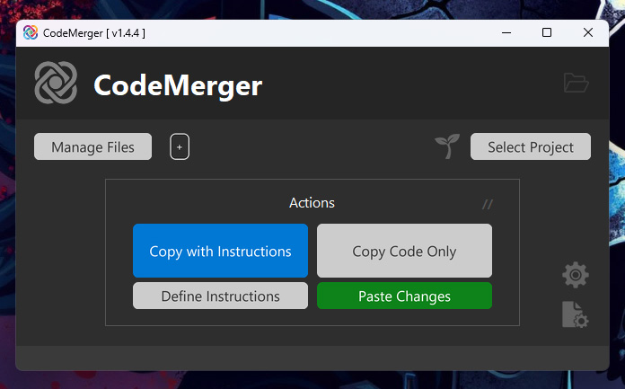
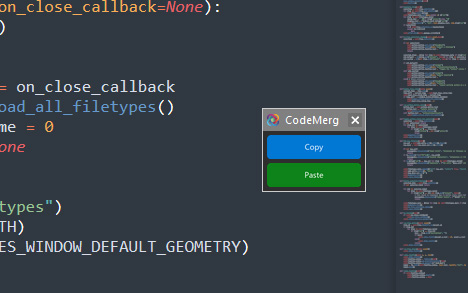
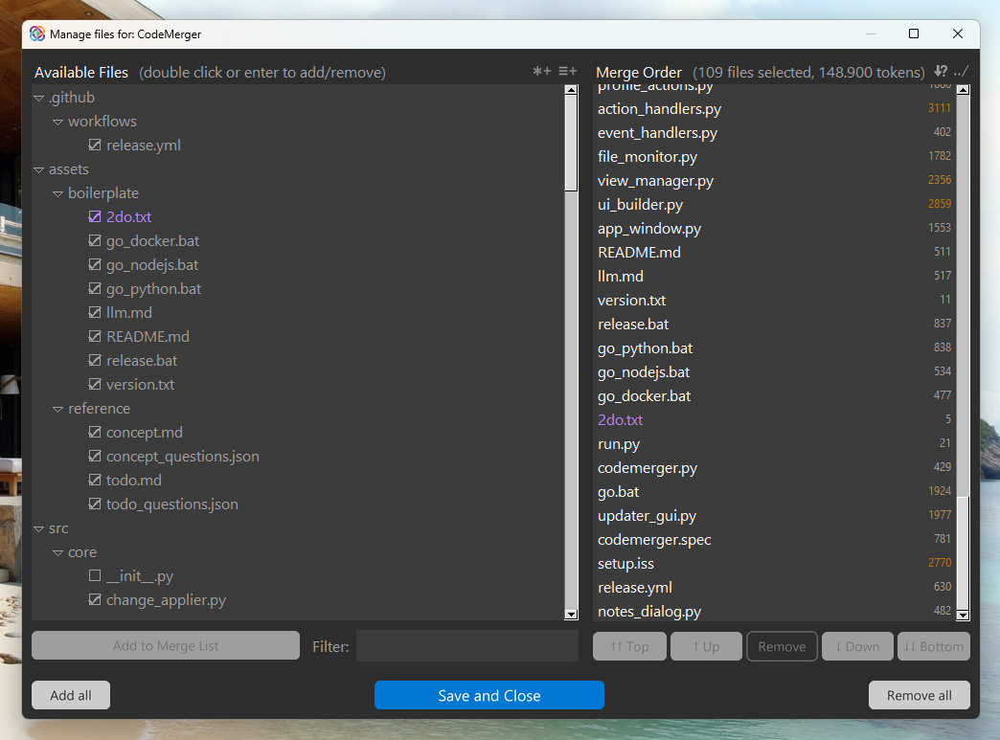
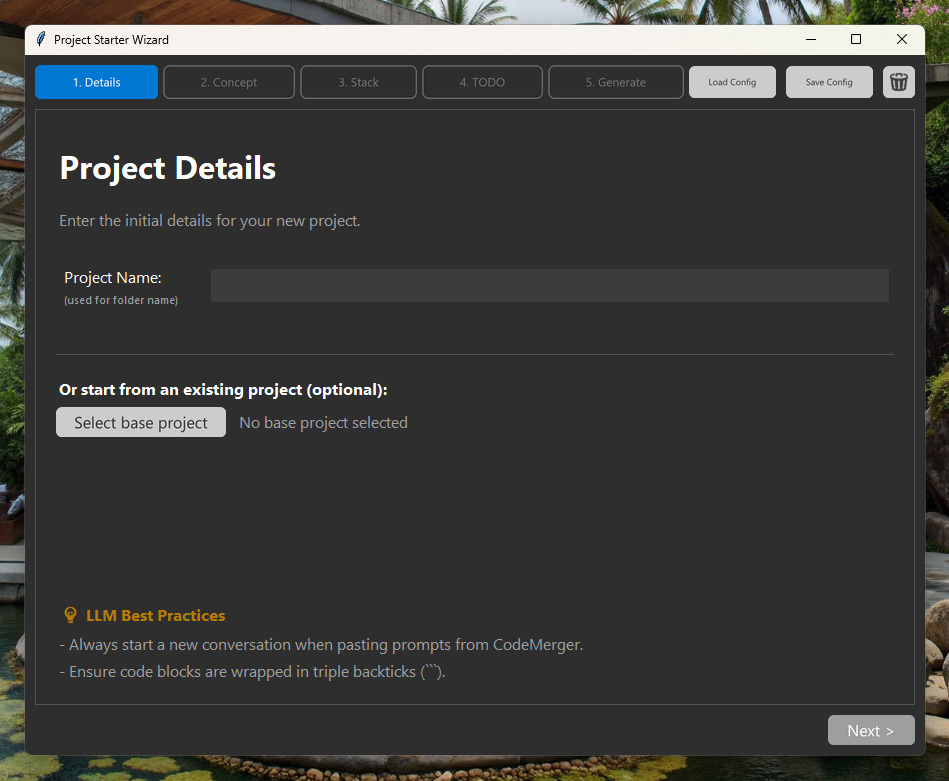

# CodeMerger

A simple app for developers that prefer to stay in control and want to avoid working in AI powered IDE's. It allows you to define which files should be merged into a single string, so you can easily paste all relevant code into an LLM. Settings for a folder are stored in a .allcode file that can be committed with your project.

I recommend using this with [Gemini](https://aistudio.google.com/prompts/new_chat?model=gemini-3-flash-preview), because there you currently get a very large context length with high rate limits for free.

## Download

Download the latest release [here](https://github.com/DrSiemer/codemerger/releases).

The download is a portable executable for Windows. Ignore the Windows Defender SmartScreen block if you get it (click "More info" > "Run anyway"). The app is safe; all it does is bundle text with a convenient UI.

## Features

- **Project-Based Settings**: Saves all your file selections, merge order, and window state in a local `.allcode` file for each project
- **`.gitignore` Aware**: The file browser automatically hides files and folders listed in your `.gitignore` file
- **New File Detection**: Automatically scans your project for new files that match your filetype settings and alerts you with a visual indicator. New files are highlighted in the list editor for easy review
- **Token Counting**: Calculates the total token count of your selected files to help you stay within an LLM's context limit
- **Customizable Prompts**: Configure a default prompt that is automatically prepended to your code when using the "Copy Code Only" button. You can also set application-wide default intro and outro texts for the instructions feature
- **Customizable Instructions**: Add project-specific text (like prompts or instructions) before and after the merged code block. You can easily load your predefined default prompts
- **Drag & Drop Reordering**: Easily reorder the files in your merge list to control the final output structure
- **Compact Mode**: A small, always-on-top, draggable window for quick access to core functions that appears when the main window is minimized. It includes an adaptive copy button (Copy with Instructions / Copy Code Only) and a paste button.
- **Recent Projects**: Quickly switch between your recent project folders
- **Project Colors**: Assign a unique color to each project for easy identification in compact mode

## Usage

- **Select a project**
    - Click "Select project" to browse for a folder or choose one from your recent projects list
- **Edit Merge List**
    - A warning icon will appear in the top bar if new files are detected in your project. Click this or the "Edit Merge List" button to open the list editor
        - **Ctrl-clicking** the new files icon will immediately add all new files to the current merge list without opening the list editor.
    - In the "Edit Merge List" window, a tree of available files is shown on the left
        - Newly detected files are highlighted in green for easy identification
        - Files listed in `.gitignore` are automatically hidden
        - Double-click a file or select it and click the button to add/remove it from the merge list
    - The "Merge Order" list on the right shows the files that will be copied
        - Drag and drop files or use the buttons to reorder them
        - The window title displays the number of selected files and the total token count
    - Double-click a file in either list to open it in your default or configured editor
    - Click "Update Project" to save your selection to `.allcode`
- **Add Instructions**
    - Click "Define Instructions" to add a project-specific introduction or conclusion that will be wrapped around the merged code block
    - You can click the "Load Defaults" icon in this window to populate the fields with your predefined default prompts from the Settings
- **Copy Prompt**
    - Click "Copy Code Only" to merge the selected files and prepend your custom prompt (configured in Settings). This is useful for providing ongoing context to an LLM. The keyboard shortcut for this action is **`Ctrl+Shift+C`**.
    - If you added instructions, a "Copy with Instructions" button will appear to include your project-specific intro/outro text. This is ideal for starting a new conversation. The keyboard shortcut for this action is **`Ctrl+C`**.
- **Paste Changes**
    - To apply changes from a language model, you can use the paste functionality.
    - Click **"Paste Changes"** or press **`Ctrl+V`** to apply changes from your clipboard. Depending on your settings, this will either open the "AI Response Review" window or apply changes instantly.
    - **Ctrl-clicking** the button (or **`Ctrl+Shift+V`**) will toggle the automatic review behavior (doing the opposite of your current settings).
    - **Alt-clicking** the button will open the manual "Paste Changes" window for raw text input.
- **Compact Mode**
    - Minimize the main window to activate the compact mode panel. All keyboard shortcuts (`Ctrl+C`, `Ctrl+Shift+C`, `Ctrl+V`, and `Ctrl+Shift+V`) are also active in this mode.
    - The panel contains two primary buttons:
        - **Copy Prompt (Instructions/Only)**: A single adaptive button for copying code.
            - It appears as "Copy with Instructions" if you have defined instructions for the project, and "Copy Code Only" if you have not.
            - A normal click performs the action shown on the button.
            - Holding **Ctrl** while clicking will always perform the "Copy Code Only" action.
        - **Paste**: Applies changes from your clipboard. A normal click follows your "AI Response Review" settings. **Ctrl-click** toggles that behavior, and **Alt-click** opens the manual paste window.
    - The panel is colored with your project's assigned color.
    - A warning icon will appear in the move bar if new files are found.
        - **Click** the icon to restore the main window and open the list editor.
        - **Ctrl-click** the icon to immediately add all new files to the merge list.
    - Double-click the move bar or click the close button to exit compact mode and restore the main window. **Ctrl-clicking** the close button will exit the application immediately.

### Settings

- **Application Updates**: Enable or disable the automatic daily check for new versions
- **Window Behavior**: Disable the automatic compact mode when the main window is minimized
- **File System Monitoring**: Configure the automatic check for new files (enable/disable and set the check interval)
- **Secret Scanning**: Enable a check for potential secrets (API keys, etc) that runs before copying code to the clipboard
- **Prompts**:
    - **"Copy Code Only" Prompt**: Set the default text that is automatically prepended when you click "Copy Code Only"
    - **Default Intro/Outro Prompts**: Define reusable, application-wide default texts for the instructions feature. These can be quickly loaded into any project's specific instructions
- **Default Editor**: Select your preferred editor for opening files from the list editor (leaving it blank uses the system default)
- To manage indexed filetypes, click "Manage Filetypes" from the main window

## Development

- Make sure you have [Python](https://www.python.org/downloads/) installed (and added to your PATH)
- Make sure you have [Inno Setup](https://jrsoftware.org/isdl.php) installed
- Before starting development, run `npm install` in the `/frontend` directory.

### Commands

- `go`: Starts the app using the **Production Bundle**. This uses the pre-compiled files in `/frontend/dist`. Use this to verify the app before building.
- `go dev`: Starts the app in **Development Mode**. It uses `concurrently` to launch the Vite development server and the Python backend at once. This enables Hot Module Replacement (instant UI updates as you save code).
- `go fe`: Manually start the Vite development server only.
- `go api`: Manually start the Python backend in dev-link mode (expects Vite at localhost:5173).
- `go b`: Build the full application (compile frontend + bundle executable + create installer).
- `go ba`: Build the executable only.
- `go r`: Push or update a release on Github using Actions.
    - Update `/version.txt` if you want to create a new release
    - You can add a comment to the release like this: `go r "Comment"`
- When the app is installed, config can be found in `%APPDATA%\CodeMerger`

## License

CodeMerger is free to use for personal and commercial development. However, the distribution of modified versions, resale, or rebranding is strictly prohibited. If you wish to contribute to the project, please reach out via GitHub. See the [LICENSE](LICENSE) file for the full legal text.