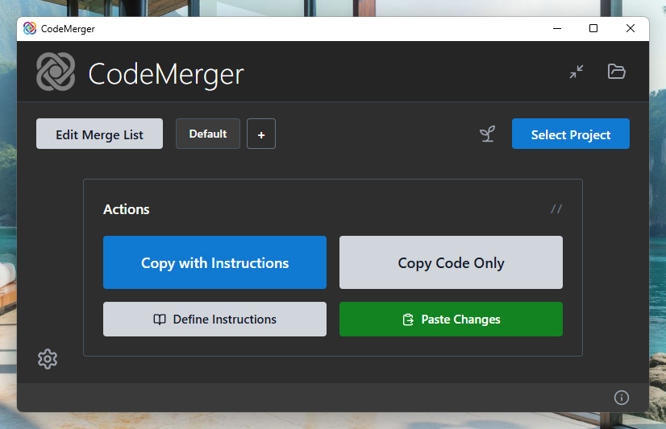
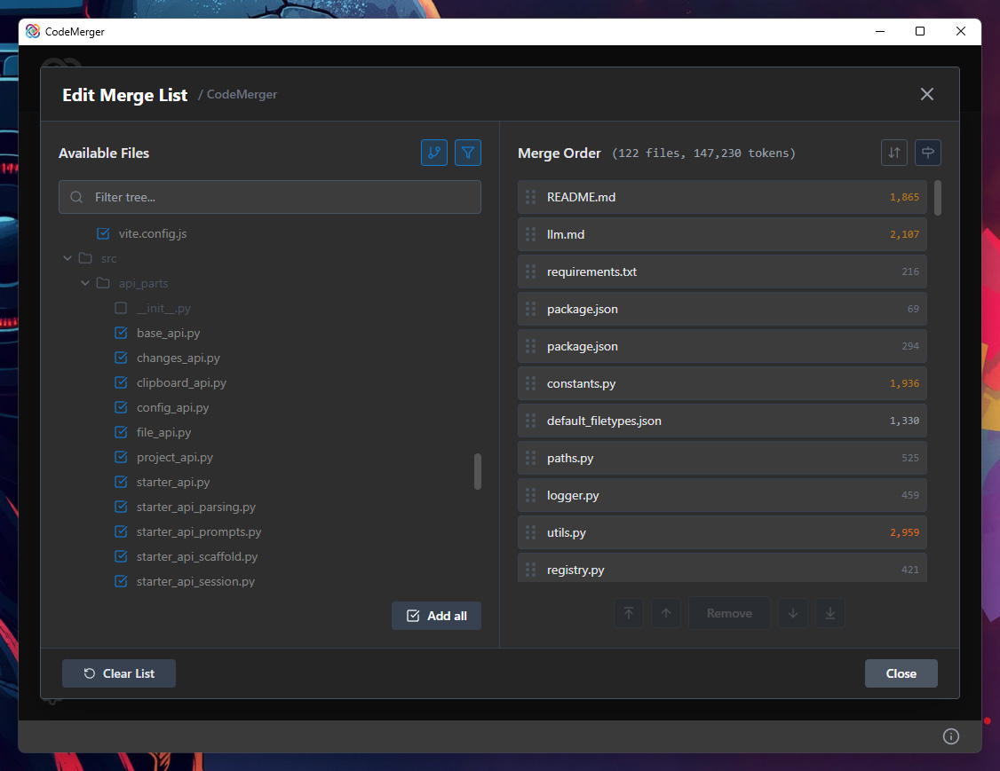
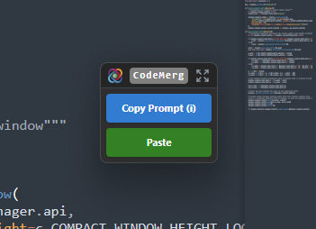
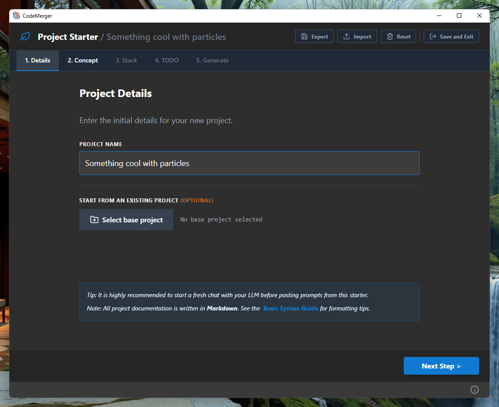

# CodeMerger

CodeMerger is a lightweight desktop application designed for developers who want to maintain absolute control over their code context when working with Large Language Models (LLMs). Instead of relying on AI-powered IDEs that silently scan your entire workspace, CodeMerger lets you explicitly hand-pick, order, and bundle specific files into a single, highly optimized text string that you can paste directly into your AI assistant of choice.

By saving your file selections and instructions in a local `.allcode` file, you can easily resume your session or share the context configuration with your team.

*Tip: We recommend using CodeMerger with models like [Gemini Flash Latest](https://aistudio.google.com/prompts/new_chat?model=gemini-flash-latest), which has a generous free tier, with massive context windows capable of handling large code bundles.*

## Download

Download the latest portable executable for Windows from the [Releases page](https://github.com/DrSiemer/codemerger/releases).

*(Note: If you encounter a Windows Defender SmartScreen block, click "More info" > "Run anyway". CodeMerger is a safe, local-only utility.)*

## Key Features

- **The "No-Chunking" Advantage**: By providing an LLM with full, unabridged source files, it eliminates hallucinations caused by missing context.
- **Web-UI Optimized**: Specifically designed for a manual copy-paste workflow. This allows you to use the most powerful models for **FREE** through their standard web interfaces (like [Google AI Studio](https://aistudio.google.com/)) rather than paying for API credits or specialized IDE subscriptions.
- **Closed-Loop AI Review**: Once the AI generates a response, paste it back into CodeMerger. The app automatically parses the output into navigable segments (Intro, Changes, Answers, Verification), allowing you to approve or reject file modifications line-by-line using an interactive diff viewer before any code is written to disk.
- **Guided Project Starter**: A structured, guided workflow for building new applications. It helps you and your LLM generate a cohesive concept, tech stack, and step-by-step TODO plan before scaffolding the boilerplate.
- **Compact Widget**: Minimize the main window to activate a tiny, always-on-top panel. It handles the "Copy Context / Paste Changes" loop so you never have to leave your editor.

## Core Workflow

1. **Select a Project**: Browse for a folder. CodeMerger will automatically create a `.allcode` profile to save your settings.
2. **Edit Merge List**: Click "Edit Merge List" to open the file manager.
   - Select the specific files you want to share with the AI.
   - Drag and drop the selected files to dictate the order in which the AI reads them. Use the "Order Request" to let an LLM determine the optimal order.
3. **Add Instructions**: Click "Define Instructions" to prepend goals or append code style rules to your project bundle.
4. **Copy Code**:
   - Click **"Copy with Instructions"** (`Ctrl+C`) to bundle the code and wrap it with your custom prompts. Ideal for starting a new chat.
   - Click **"Copy Code Only"** (`Ctrl+Shift+C`) to quickly bundle the code with a simple update header. Ideal for asking questions or updating an existing conversation with the latest context if you made changes outside the conversation.
5. **Paste Changes**: Once the AI gives you updated code, click **"Paste Changes"** (`Ctrl+V`) to import it. CodeMerger parses the AI's Markdown response and opens the **AI Response Review** window, allowing you to diff and approve file modifications line-by-line.

## Compact Mode

When you minimize the main window, CodeMerger transforms into a compact, always-on-top widget.

- Access your standard "Copy" and "Paste" actions without leaving your IDE.
- Color-coded to match your active project.
- Supports all global keyboard shortcuts (`Ctrl+C`, `Ctrl+Shift+C`, `Ctrl+V`).
- Double-click the title bar or click the expand icon to restore the full dashboard.

## Project Starter

CodeMerger includes a built-in Project Starter to help you kick off new ideas. It provides a structured workflow, that guides you and your LLM through generating a solid project foundation.

- **Concept Generation**: Define your goal and let the AI generate a structured problem statement, feature list, and user flows.
- **Stack Selection**: Get intelligent technology recommendations based on your experience and the generated concept.
- **TODO Plan**: Generate a detailed, phase-by-phase implementation plan.
- **Interactive Refinement**: Lock approved segments, request targeted rewrites, and ask contextual questions before scaffolding the final codebase directly to disk.

### Command Line Arguments (Advanced)

- `--console`: Spawns a native command prompt alongside the app for real-time logs.
- `--inspect`: Enables "Inspect Element" and Developer Tools (Ctrl+Shift+I) for debugging.

## Development

- Requires [Python 3.10+](https://www.python.org/downloads/) and [Node.js](https://nodejs.org/) installed.
- Run `go i` before starting.

### Commands
The project uses a `go.bat` script to orchestrate all development and build tasks.

**Running the App**

- `go`: Starts the app (builds production frontend if missing).
- `go dev`: Starts Vite HMR and the Python backend concurrently.
- `go debug`: Starts the app in production mode with DevTools enabled.
- `go api`: Starts only the Python backend in development mode (expects Vite at port 5173).
- `go fe`: Starts only the Vite development server.

**Building & Distribution**

- `go b`: **Full Build**. Compiles frontend, bundles executable, and creates the installer.
- `go ba`: Build App Only (frontend + executable).
- `go bi`: Build Installer Only (requires existing `dist\CodeMerger` folder).
- `go br`: Rebuilds the production frontend and then starts the app.

**Environment & Utilities**

- `go i`: Installs node modules for the frontend.
- `go cmd`: Opens a new command prompt with the Python virtual environment pre-activated.
- `go f`: Freezes current Python dependencies into `requirements.txt`.
- `go r "Comment"`: Handles the release process (verifies branch, creates Git tag, and pushes).

*Configuration is stored in `%APPDATA%\CodeMerger`.*

## License

CodeMerger is free to use for personal and commercial development. However, the distribution of modified versions, resale, or rebranding is strictly prohibited. If you wish to contribute to the project, please reach out via GitHub. See the [LICENSE](LICENSE) file for the full legal text.